<div align="center">


</div>

<br/>

<h1 align="center">启程学堂</h1>

<p align="center">
  <strong>面向 8–14 岁少儿编程的 K12 全栈学习平台</strong>
</p>

<p align="center">
  课程学习 · 内容块专注 · 练习作业 · 判题考试 · 错题本 · 编程工作台 · 学习进度 · 后台管理
</p>

<p align="center">
  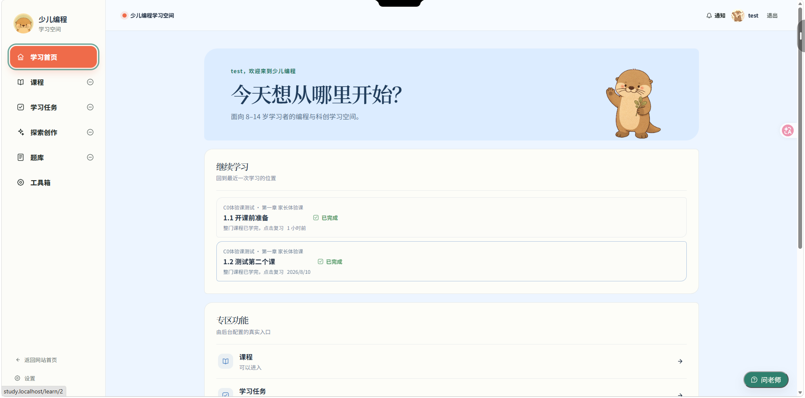
</p>

---

## 项目简介

**启程学堂** 把「课程内容 + 作答反馈 + 学习进度」连接成同一个可复用的学习闭环。登录后的学习工作台专注回答三件事——**继续学什么、今天做什么、完成得怎样**。

平台由**双端**组成:面向学员的学习工作台,以及一套独立的**内容管理后台**。后台按「配题 · 配课 · 运营」组织,覆盖题库 / 试卷 / 考试链接、课包 / 学习目录 / 内容编排 / 资料 / 视频,以及学员 / 班级 / 成绩 / 账号权限 / 审计日志的全流程运营。学员端看到的课程、题目、考试与数据范围,全部由后台真实维护、由服务端裁决——前端不自造任何业务白名单。

| 原则 | 落地方式 |
|------|---------|
| 一次只做一件事 | 课时一次只呈现一种学习行为(视频 / 阅读 / 练习 / 作业),不把内容堆在同一屏 |
| 状态来自服务端 | 解锁规则、尝试次数、评分、完成状态、数据范围一律由后端裁决,前端只负责呈现 |
| 权限即数据边界 | 双主体身份 + 动态 RBAC;`scope` 决定「作用在哪些数据上」,`capability` 决定「能不能做」 |

> 纸白 · 薄荷绿视觉体系 + 水獭学习伙伴 IP;面向青少年,活泼但不幼儿化。

## 技术栈

- **前端**:Vue 3.5(Composition API)· Vue Router · Vite 6 · Tailwind CSS 4 · video.js(HLS 视频)· marked + DOMPurify;学生端为 Vue SPA,**管理端为原生 HTML/JS**
- **后端**:Python · FastAPI 0.141 · SQLAlchemy 2.0 · psycopg 3 · Alembic 迁移 · Celery + Redis(异步判题 / 限流)· boto3(对象存储)· Pillow(验证码)· PyJWT
- **独立子应用**:Scratch(图形化编程)· 打字星球 · 数学星球 · 专注星球

## 核心功能

### 课程与学习
```
选课程 → 章节课时 → 内容块(视频 / 阅读 / 练习 / 作业 / 资料)
    → 作答 → 服务端判题评分 → 记录进度 → 回到上次停下的位置
```
- **内容块学习**:一次专注一项,右侧时间轴显示完成进度
- **HLS 视频**:签名流播放,记录观看进度
- **学习进度**:派生自服务端真实作答与完成状态,不由前端猜测

### 练习 · 作业 · 考试
- 统一题库(选择 / 填空 / 编程判题)、评分与成绩流程
- **进程内判题**:有界重试轮询到终态,判题失败自动退还尝试次数
- **考试时间窗**:作答开放状态以服务端物化为准(定时关闭过期作答)
- **错题本**:自动归集判错题目,支持重做、复习任务与掌握度统计

### 编程工作台 · 工具箱
- Scratch 图形化编程,作品广场公开展示、点开即可运行
- 打字星球、数学星球(24 点)、专注星球(番茄钟)等轻量学习工具

### 后台管理
- **配题**:题库、试卷、考试链接
- **配课**:课包、学习目录、内容编排、资料、视频
- **运营**:学员、课程开通、班级、教学 / 答疑工作台、成绩统计、账号与角色、审计日志

### 安全
- CSRF 双提交 + httpOnly 会话;access / refresh 双令牌与主动续期
- 图形验证码 + 滑块验证码;基于 IP / 地理位置的登录风控
- 密码历史 + 泄露口令检查 + MFA / TOTP;接口级限流;双主体身份隔离

## 项目截图

### 学习闭环

登录后进入专属学习空间——「今天想从哪里开始?」,聚合继续学习与专区功能入口。


按课程类型与方向筛选课包 · 进入课包后展开章节与课时目录:

<p align="center">
  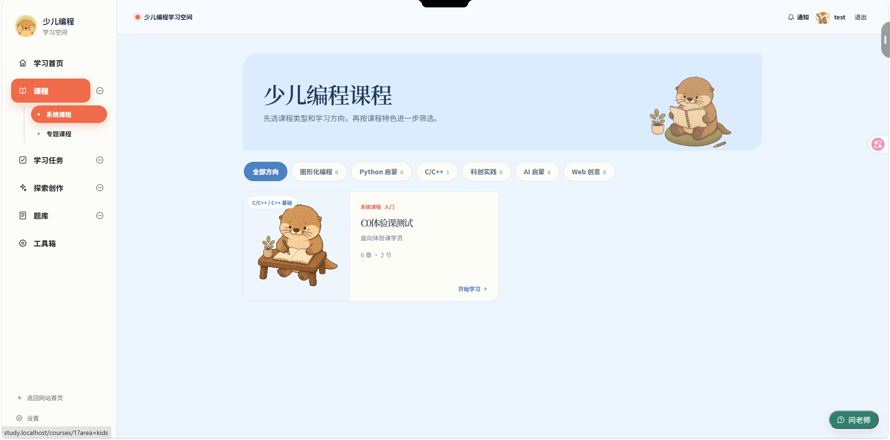
  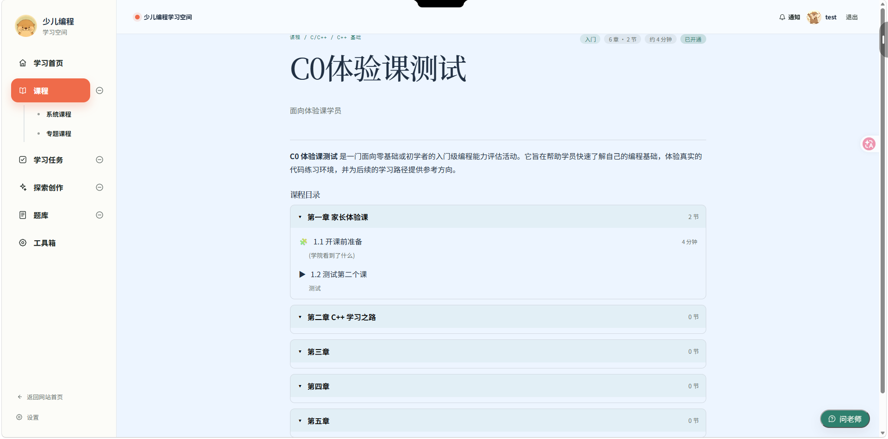
</p>

课时一次专注一个内容块,右侧时间轴显示完成进度:

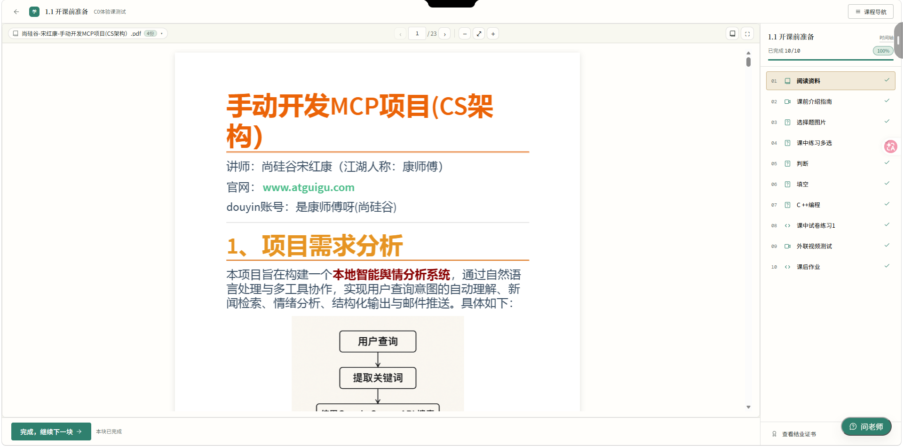

内置编程判题(在线代码编辑器 + 样例运行 + 提交判题)与课程视频:

<p align="center">
  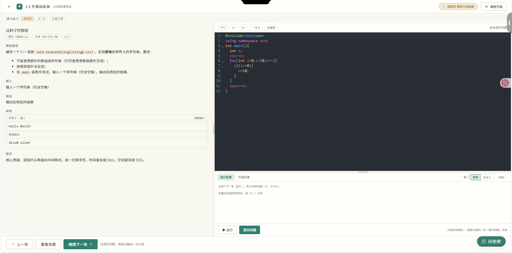
  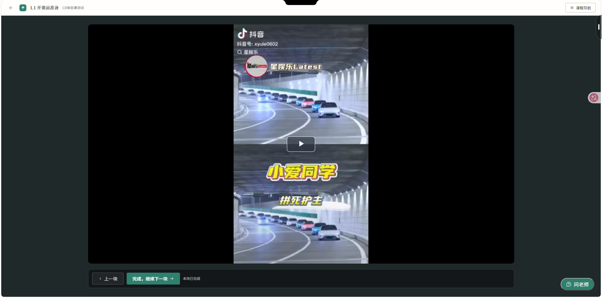
</p>

错题本自动归集判错题目,支持重做、复习任务与掌握度统计:

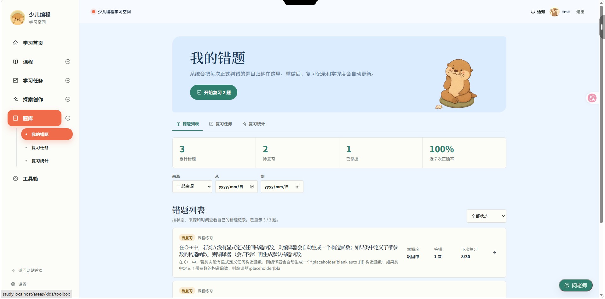

### 探索创作(Scratch)

作品广场展示公开的 Scratch 作品,点开即可运行;内置图形化编辑器:

<p align="center">
  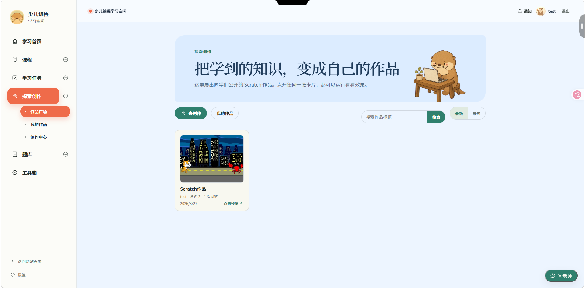
  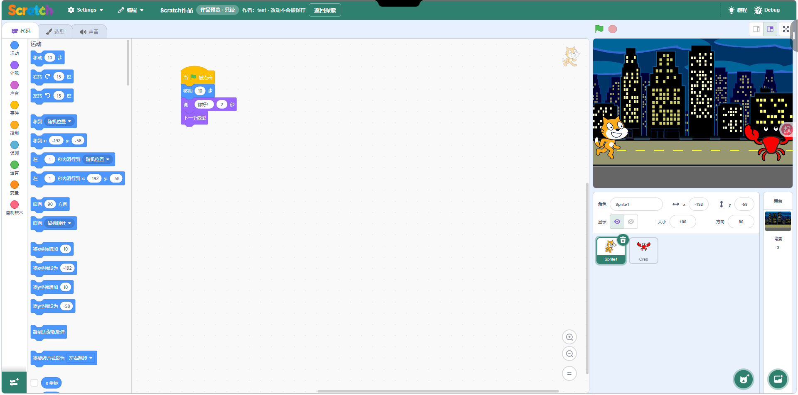
</p>

### 工具箱

轻量学习工具集合,即开即用:

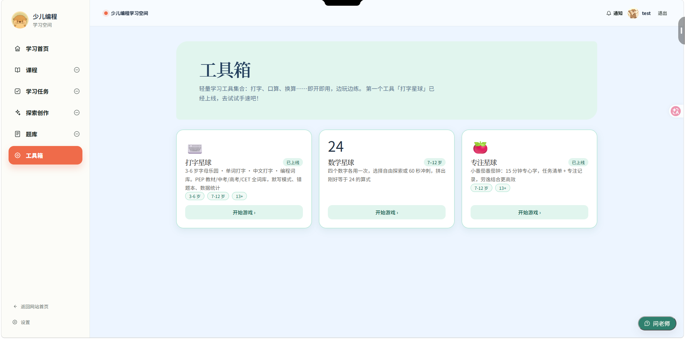

<p align="center">
  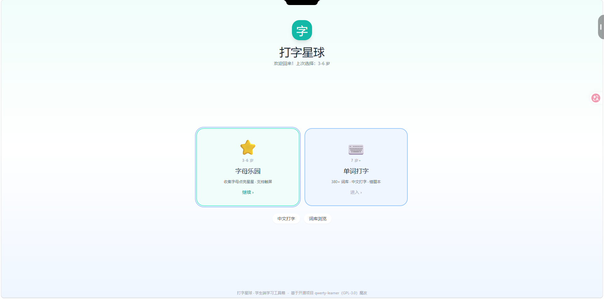
  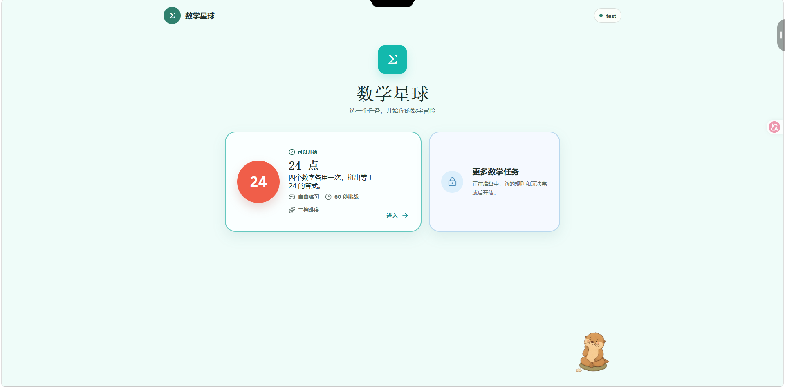
  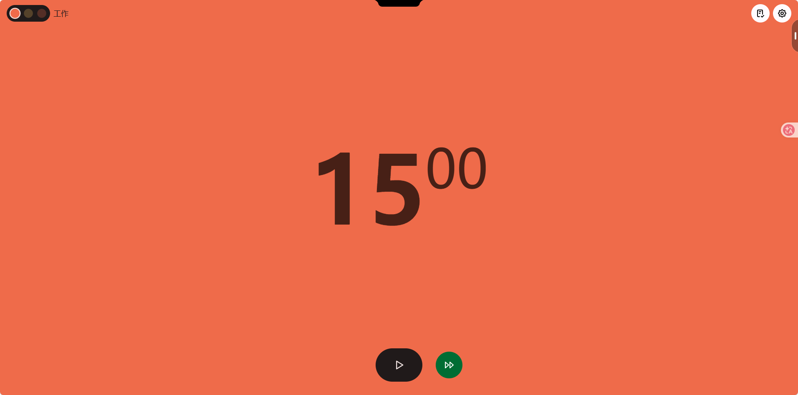
</p>

<p align="center"><sub>打字星球 · 数学星球(24 点)· 专注星球(番茄钟)</sub></p>

### 后台管理控制台

管理端按「配题 · 配课 · 运营」三大板块组织,从内容生产到教学运营一处贯通:

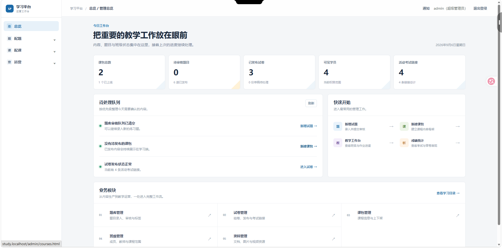

考试链接管理:一张试卷可挂多条独立的考试安排(时间窗、次数、时长、启停各自独立):

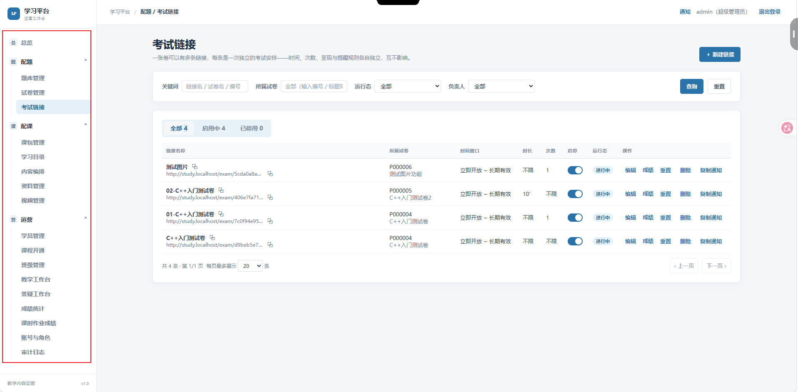

## 快速开始

> 需要本地 **PostgreSQL**(默认库 `study_auth`);Redis 可选(不配则用进程内限流器)。

```bash
# 1. 后端:配置 .env,执行迁移并启动
cd 后端程序/auth_service
# .env: DATABASE_URL=postgresql+psycopg://<user>:<pass>@127.0.0.1:5432/study_auth
python -m venv .venv && ./.venv/Scripts/pip install -r requirements.txt
./.venv/Scripts/python -m alembic upgrade head
./.venv/Scripts/python -m uvicorn app.main:app --port 8002 --reload

# 2. 创建后台管理员(可选)
ADMIN_USERNAME=admin ADMIN_PASSWORD='Your-Admin-pass-123!' ./.venv/Scripts/python -m app.create_admin

# 3. 前端
cd 前端程序/study-blog-vue
npm install && npm run dev
```

访问 `http://localhost:5173`。前端 dev 通过 Vite 代理把 `/api`、`/media`、`/avatars`、`/v` 及各编程子应用转发到后端(见 `vite.config.js`);生产部署参考 `部署配置/nginx-cache.conf`。

## 项目结构

```
启程学堂/
├── 前端程序/study-blog-vue/         # 学生端 Vue 3 SPA
│   ├── src/
│   │   ├── views/                  #   页面(专区 / 课程 / 课时 / 考试 / 错题 / 工具箱 …)
│   │   ├── stores/                 #   会话 / 学习目录 / 导航状态
│   │   ├── services/               #   API 封装(CSRF / 令牌续期)
│   │   └── router/                 #   路由(学习 shell / 沉浸式课时)
│   ├── public/admin/               #   管理端(原生 HTML/JS)
│   └── vite.config.js              #   dev 代理
├── 后端程序/auth_service/           # FastAPI 后端
│   └── app/
│       ├── models.py               #   ORM(双主体 users / admin_users)
│       ├── permissions.py          #   角色常量与能力目录唯一来源
│       ├── routers/                #   学生端 + 管理端接口
│       ├── judge/                  #   判题运行器
│       ├── student_tasks.py        #   学生任务派生状态唯一来源
│       └── alembic/                #   数据库迁移
├── scratch-studio / typing-studio / math-studio / focus-studio   # 编程子应用
├── 部署配置/nginx-cache.conf         # 生产 nginx 配置
└── screenshots/                    # README 截图
```

## License

MIT
